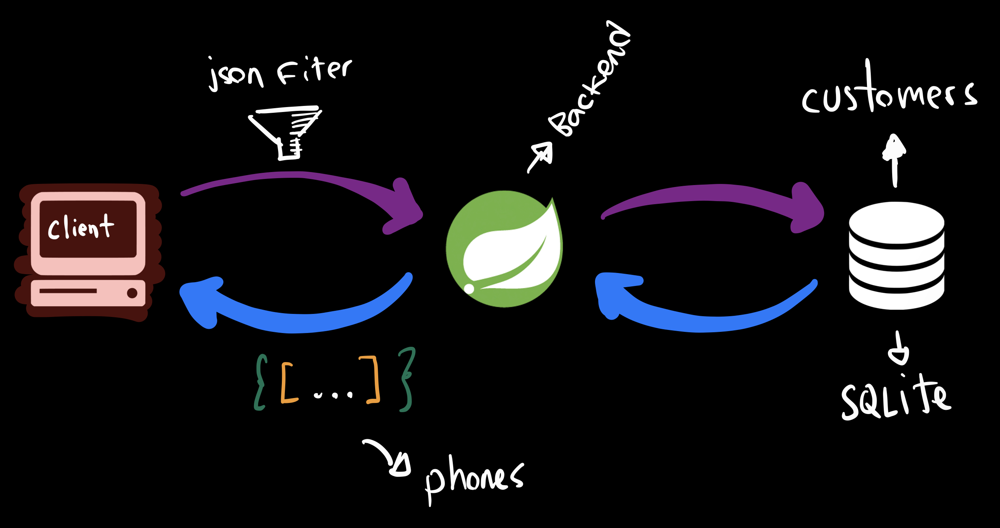
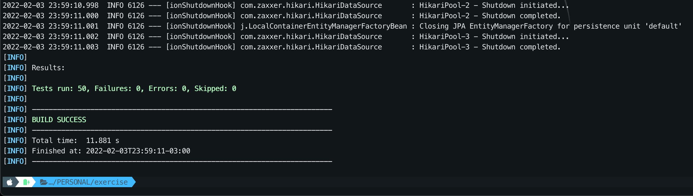

## Project Description

Project to solve an interview question described below.

## The Problem
---



Create a backend application in Java (*Frameworks allowed*) that uses the provided database (*SQLite 3*) to list and categorize country phone numbers. Phone numbers should be categorized by country, state (valid or not valid), country code and number.

**Build endpoint(s) for:**

* Rendering a list of all phone numbers available in the DB.
* It should be possible to filter by country and state.
* *Pagination is an extra.*

Upload the contents of your project to GitHub or similar.

Use dockers to quickly have a running application. Topics to take into account:

- Try to show your OOP skills
- Code standards/clean code
- Do not use external libs to validate the numbers.
- Unit Tests
- Write a README file for build/execution instructions
- Provide cURLs to test the endpoint(s)

Regular expressions to validate the numbers:


| Country    | Country Code | Regex                    |
| ------------ | -------------- | -------------------------- |
| Cameroon   | +237         | \(237\)\ ?[2368]\d{7,8}$ |
| Ethiopia   | +251         | \(251\)\ ?[1-59]\d{8}$   |
| Morocco    | +212         | \(212\)\ ?[5-9]\d{8}$    |
| Mozambique | +258         | \(258\)\ ?[28]\d{7,8}$   |
| Uganda     | +256         | \(256\)\ ?\d{9}$         |

## Tech Stack

The project use SpringBoot for core and others libs like:

**Server:** SpringBoot, SpringData, RestAssured, Git, Lombok, maven, docker end Java 17

## Installation

For Run, you just need install the Java 17 JDK, docker, git and Maven 3.6.0+ and follow the steps:

### Installing Apache Maven

The installation of Apache Maven is a simple process of extracting the archive and adding the bin folder with the mvn command to the PATH.

Detailed steps are:

Have a JDK installation on your system. Either set the **JAVA_HOME** environment variable pointing to your JDK installation or have the java executable on your **PATH**.

Extract distribution archive in any directory

```bash
  $ unzip apache-maven-3.8.4-bin.zip
```

Add the **bin** directory of the created directory **apache-maven-3.8.4** to the **PATH** environment variable

Confirm with **mvn -v** in a new shell. The result should look similar to:

```bash
Running `/Users/charlesqueiroz/Documents/Projects/PERSONAL/exercise/mvnw`...
Apache Maven 3.8.4 (9b656c72d54e5bacbed989b64718c159fe39b537)
Maven home: /Users/charlesqueiroz/.m2/wrapper/dists/apache-maven-3.8.4-bin/52ccbt68d252mdldqsfsn03jlf/apache-maven-3.8.4
Java version: 17.0.1, vendor: Oracle Corporation, runtime: /Library/Java/JavaVirtualMachines/jdk-17.0.1.jdk/Contents/Home
Default locale: en_BR, platform encoding: UTF-8
OS name: "mac os x", version: "12.1", arch: "x86_64", family: "mac"
```

### Installing Docker

To install docker on Windows, follow this link [Documentation](https://docs.docker.com/desktop/windows/install/)

## Running

To run this project, you have two options:

#### Run without docker:

```bash
  $ cd [root directory]
  $ mvn spring-boot:run
```

#### Run with docker:

```bash
  $ cd [root directory]
  $ mvn spring-boot:build-image
```

This process will build the docker image. To run execute:

```bash
  $ docker run -d --name exercise -p 8080:8080 exercise:1.0.0.Final
```

If you want to run the application with differents values for some variables, you can use the **-e** option like:

```bash
  $ docker run -d --name exercise -p 8080:8080 -e LOGGIN_LEVEL_COM_JUMIA=INFO -e LOGGIN_LEVEL_ROOT=ERROR exercise:1.0.0.Final
```

## Running Tests

To run tests, you can use the **mvn test** command.

```bash
  mvn test
```

The result should look similar to:



## CURL Exemples (Optional)

To test, you can use the **curl** commands:

```bash
  curl -X GET http://localhost:8080/api/v1/customers/phones
  curl -X GET http://localhost:8080/api/v1/customers/phones?country=CAMEROON
  crul -X GET http://localhost:8080/api/v1/customers/phones?country=CAMEROON&state=VALID
  curl -X GET http://localhost:8080/api/v1/customers/phones?size=2&page=1&country=CAMEROON
```
